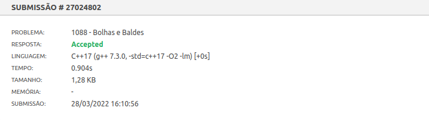
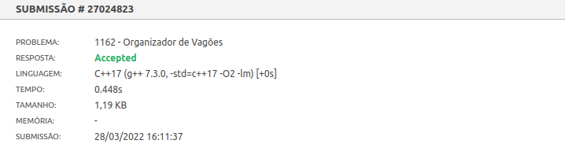
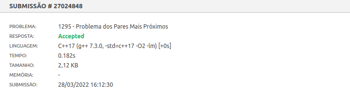
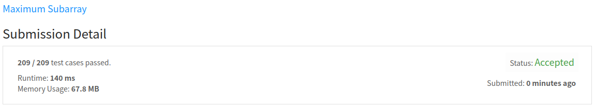

# Dividir e Conquistar - Dupla 19

**Número da Lista**: 4 
**Conteúdo da Disciplina**: Dividir e Conquistar 
**Apresentação: <a href="https://youtu.be/UqjDmvJ0JVc">assistir</a>

## Alunos
|Matrícula | Aluno |
| -- | -- |
| 18/0023411  |  Maicon Lucas Mares de Souza |
| 18/0018574  |  Hérya Rodrigues Alcantara |

## Sobre 
Resolução de questões dos sites *beecrowd* e *leetcode* utilizando uma abordagem de dividir e conquistar.

## Screenshots

### Problema 1088 - Bolhas e Baldes

### Problema 1162 - Organizador de vagões

### Problema 1295 - Problema dos Pares Mais Próximos

### Problema 53 - Maximum Subarray

## Instalação 
**Linguagem**: C++ 

* Acessar o link do problema (indicado no início de cada arquivo de solução);
* Copiar e colar o código da solução na área de submissão;
* Selecionar a linguagem C++17(beecrowd) ou C++(leetcode);
* Enviar submissão.

